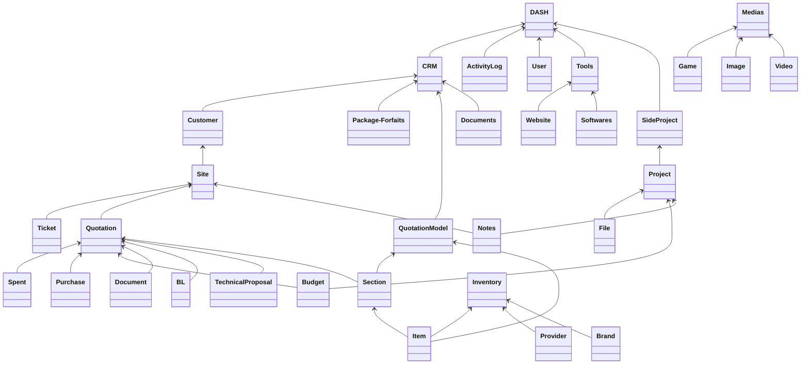

# [Database](readme.md)

## Description

Multitanancy et offline mode

## Base de données

```mermaid
classDiagram

DASH <-- CRM
DASH <-- ActivityLog
DASH <-- User
DASH <-- Tools
DASH <-- SideProject


CRM <-- Customer
CRM <-- Package - Forfaits
Customer <-- Site
Site <-- Ticket
Site <-- Quotation
Site <-- Notes
Quotation <-- Spent
Quotation <-- Purchase
Quotation <-- Budget
Quotation <-- Document
Quotation <-- BL
Quotation <-- Technical Proposal
Quotation <-- Section
Section <-- Item

CRM <-- QuotationModel
QuotationModel <-- Section
QuotationModel <-- Item

CRM <-- Documents

Inventory <-- Item
Inventory <-- Provider
Inventory <-- Brand

Medias <-- Game
Medias <-- Image
Medias <-- Video

Tools <-- Website
Tools <-- Softwares

SideProject <-- Project
Project <-- File
Project <-- Budget
Project <-- Notes

```
